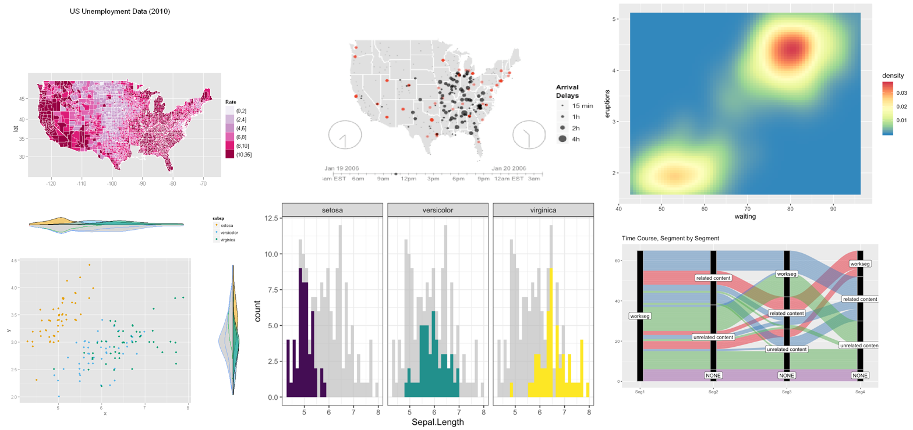
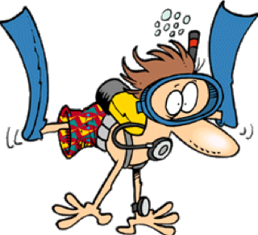
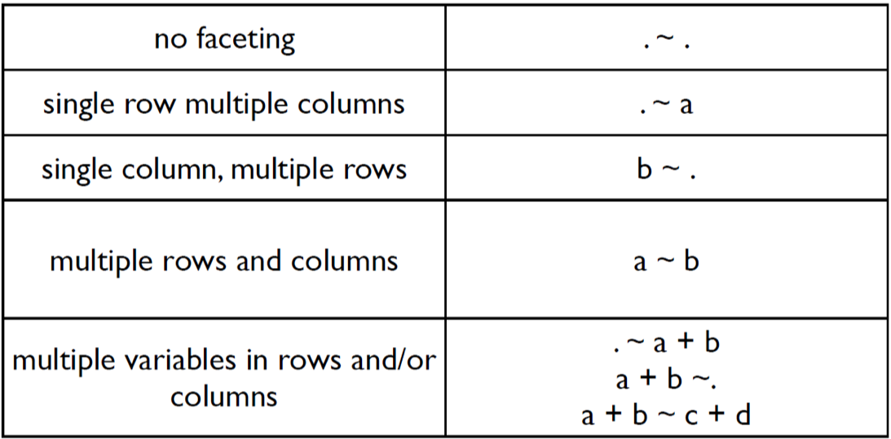
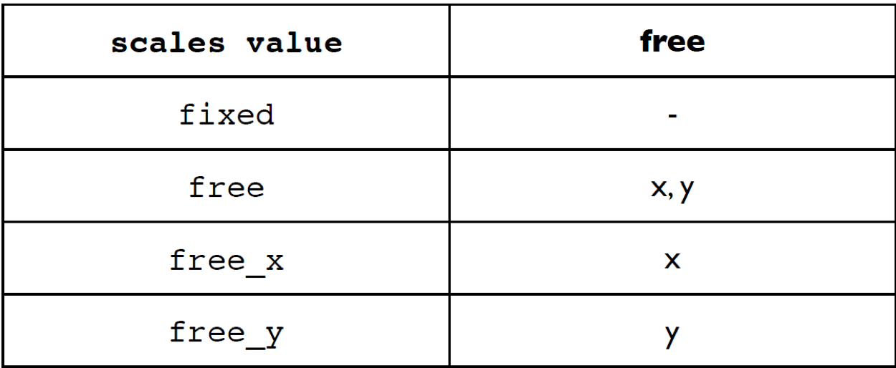

class: inverse, center, middle

```{r setup, include=FALSE}
options(htmltools.dir.version = FALSE)
library(tidyverse)
library(ggplot2)
library(icon)
```

```{r use-logo, echo=FALSE}
xaringanExtra::use_logo("img/logo.png")
```


# A quick introduction to R projects and github
(adopted from the GLOBE R working group)

---

# What is Git and Github

* Git is a version control system that lives on your computer. Think "track changes" for files.

* Github is "Dropbox" for git-based projects on the internet.

.center[

]

---

# What github us used for

- share/store analyses and functions
- browse past versions of code
- browse source code ([CRAN](https://github.com/cran),  [tidyverse](https://github.com/tidyverse/), [rOpenSci](https://github.com/ropensci))
- use packages not on CRAN (`devtools::install_github("account/repo")`)
- host web pages 

<br>  
You get unlimited private GitHub repositories for _free_ (normally $7/month) while you are a student! Sign up [here](https://education.github.com/pack).

---
# GitHub terminology

- **repository** or repo - project/folder `r fa_folder()`
- **local** - files stored on your computer `r fa_file_code()` `r fa_file_image()` `r fa_file_excel()`
- **remote** - files on github.com `r fa_github()`

---
# R projects

.pull-left[


Comfortable but hard to reproduce
]


.pull-right[
 

Portable, organized, minimalistic
]


---
# What's the deal with projects?

Each project is a self-contained set of files. Projects make it **easy to transfer** files to another computer because its **boundaries are clearly defined**

.center[

]
---
# Why use projects?

Projects help to maintain good workflow habits:

- **Fresh R processes** - each project comes with its own environment
- **Portability** - projects have clearly defined base directories; makes it easy to [use relative paths](https://www.tidyverse.org/articles/2017/12/workflow-vs-script/) 

Extra reading: [basic care and feeding of data in R](http://stat545.com/block006_care-feeding-data.html)

---
# Use relative paths inside projects
 
- looks cleaner
- works for other people/computers

```{r eval = FALSE}
read.csv("data/eilat_survey_2017.csv")
#rather than
read.csv("C:/חזי/phd/thesis/reef_surveys/data/eilat_survey_2017.csv")
# or
setwd("C:/חזי/phd/thesis/reef_surveys/data")
read.csv("/eilat_survey_2017.csv")
```

You never have to use `setwd()` again! 

---
class: inverse
background-image: url(http://ohi-science.org/data-science-training/img/clone_step1.png)
background-position: center
background-size: 100%
---
class: inverse
background-image: url(http://ohi-science.org/data-science-training/img/new_project_1.png)
background-position: center
background-size: 100%
---
class: inverse
background-image: url(http://ohi-science.org/data-science-training/img/new_project_2.png)
background-position: center
background-size: 100%
---
class: inverse
background-image: url(http://ohi-science.org/data-science-training/img/new_project_3.png)
background-position: center
background-size: 100%
---
class: inverse
background-image: url(https://media.giphy.com/media/vt4gALQsxCDmM/giphy.gif)
background-position: center
background-size: 100%
---
class: inverse
background-image: url(https://media.giphy.com/media/vt4gALQsxCDmM/giphy.gif), url(http://ohi-science.org/data-science-training/img/new_project_4.png)
background-position: bottom right, center
background-size: 30%, 100%
---
class: inverse, center, middle

# Let's start with `ggplot2`
---
class: center, middle

# The idea behind `ggplot2`

Combining all the good and leaving out all the bad of all base R packages for plotting

---

# Some examples



---

# What `ggplot2` can do?

Almost anything you want it

.center[

]
---

# What `ggplot2` can't do?

It can't choose for you which graphics represent your data best

.center[

]

---

# The basics of `ggplot2`

* Based on the Grammar of Graphics (Wilkinson, 2005)

* Based on a layer system

* Flexible set of components for creating any type of graphics

---

# Specification

Components of a graphic:

* **DATA** - the dataset that will be used for the other components

* **TRANS** - variable transformation

* **SCALE** - scale transformation

* **ELEMENT** - graphs and their aesthetic attributes

* **COORD** - a coordinate system

* **GUIDE** - one or more guides

---

class: center, middle

## Install the package using `install.packages("ggplot2")`

## load the package with `library(ggplot2)`

---

# Two options of working with the package

**`qplot()`** - quick and dirty plotting. Limited options

**`ggplot()`** - base function for more versatile plotting

---

.center[
# `qplot()`
]

* Syntax similar the the `base` R `plot()`

* **x** == predictor

* **y** == response

* **data** == the data frame that holds the variables to plot

```{r eval=FALSE, include=TRUE}
qplot(x,y,data = mydata)
```

---

# Example using the `iris` dataset


```{r fig.height=5, fig.width=5}
qplot(x = Sepal.Width,y = Petal.Width,data = iris)
```

---
# The building blocks of `ggplot()`


A .green[**plot**] is made up of multiple layers. 

A .green[**layer**] consists of data, a set of
mappings between variables and
.green[**aes**]thetics, a .green[**geom**]etric object and a
.green[**stat**]istical transformation.

.green[**Scales**] control the details of the mapping.
All components are independent and
reusable.

---

# Advantages of the layers system

* Change a single feature at a time

* Create new types of plots on the fly

* Cure against immobility

* Developers can easily develop new layers without affecting other layers

---

class: inverse, center, middle

# Lets dive into the syntax




---

# Anatomy of the plot

1. .green[**Data**] – the dataset name that you want to present

2. .green[**Aesthetics**] – the variables you want to use in the plot

3. .green[**Geom**] – the type of plot you want do

4. **Themes** – control presentation of non-data elements

5. **Stat** – statistical transformations 

6. **Scale** – define parameters of the plot (exp: x-axis, color, etc.)

.bottom-left[
*The green variables are mandatory to create a plot
]
---

# 1. Data

In `ggplot()` you always have to specify what data you are using for the plot.

Thus, you always work with data.frames/tibbles

```{r fig.height=3, fig.width=3}
ggplot(data = iris,aes(x = Sepal.Width,y = Petal.Width))
```

.footnote[
*R function are placement based which means it anticipates the parameters type based on location. So you don't have to write "data", "x", "y" if you place them in the right place
]
---

# 2. Aesthetic mapping

In `ggplot()` land it means "something you can see" and it includes:

* Position (x and y)

* Color (a name of a color or a vector that will be used for color)

* Fill (a name of a color or a vector that will be used for color)

* Shape (a name of a shape or a vector that will be used for shape)

* Line type

* Size

---

# 3. Geometric objects aka `geom`

* A geom can only display certain aesthetics

* A plot must have at least one geom but there is no upper limit

---

# Lets look at some examples using **PanTHERIA** dataset

**Load the data**

```{r message=FALSE, warning=FALSE}
pantheria<- read_csv("data/sub_PanTHERIA.csv") %>% 
  na.omit() %>% mutate(HabitatBreadth = as.character(HabitatBreadth))
pantheria
```

---
## `geom_histogram()`


```{r fig.height=5, fig.width=5, message=FALSE, warning=FALSE}
ggplot(pantheria,aes(x = log10(AdultBodyMass)))+
  geom_histogram()
```

---

## `geom_point()`

```{r fig.height=5, fig.width=5, message=FALSE, warning=FALSE}
ggplot(pantheria,aes(log10(AdultBodyMass),log10(LitterSize)))+
  geom_point()
```

---
class: exercise, center, middle

# Lets practice!

## First plot:

Plot a histogram for age at first birth and litter per year

---

class: exercise, center, middle

## Second plot:

Plot a scatter plot for litter per year as a function of gestation length

---
# 4. Statistical Transformations

* Each geom has a default statistic, but these can be changed

* plots, such as boxplots, barplot, prediction lines etc. require statistical transformations

---

# Example

```{r error=TRUE}
ggplot(pantheria,aes(Order,log10(AdultBodyMass)))+
  geom_bar()
```


.bottom-left[
The default statistics for `geom_bar()` is a histogram count. 
]
---

**The fix**

```{r fig.height=5, fig.width=5}
ggplot(pantheria,aes(Order,log10(AdultBodyMass)))+
  geom_bar(stat = "identity")#<<
```

---

# 5. Scales

* Control mapping from data to aesthetic attributes

* One scale per aesthetic

* general syntax: `scale_<aesthetic>_<type>`


---

# Examples

### Plotting using default colors

Plotting the litter size as a function ob body mass grouped for activity cycle

```{r fig.height=4, fig.width=5}
ggplot(pantheria,aes(log10(AdultBodyMass),log10(LitterSize),
                     color = ActivityCycle))+
  geom_point()
```

---
### Plotting with `scale` option

**Scale color using `RColorBrewer`**
```{r fig.height=4, fig.width=5}
library(RColorBrewer)
ggplot(pantheria,aes(log10(AdultBodyMass),log10(LitterSize),
                     color = ActivityCycle))+
  geom_point()+
  scale_color_brewer(palette = "Dark2") #<<
```

---

## Scaling a parameter that is not defined does nothing. Example with trying to scale the shape

```{r fig.height=4, fig.width=5}
ggplot(pantheria,aes(log10(AdultBodyMass),log10(LitterSize),
                     color = ActivityCycle))+
  geom_point()+
  scale_color_brewer(palette = "Dark2")+
  scale_shape(solid = T) #<<
```

---
## So how to add shape?

```{r fig.height=4, fig.width=5, eval=FALSE}
ggplot(pantheria,aes(log10(AdultBodyMass),log10(LitterSize),
                     color = ActivityCycle,shape = ActivityCycle))+ #<<
  geom_point()+
  scale_color_brewer(palette = "Dark2")
```
---
.center[
```{r echo=FALSE}
ggplot(pantheria,aes(log10(AdultBodyMass),log10(LitterSize),
                     color = ActivityCycle,shape = ActivityCycle))+
  geom_point()+
  scale_color_brewer(palette = "Dark2")
```
]
---
## Scale shape parameters:

```{r fig.height=4, fig.width=5, eval=FALSE}
ggplot(pantheria,aes(log10(AdultBodyMass),log10(LitterSize),
                     color = ActivityCycle,shape = ActivityCycle))+
  geom_point()+
  scale_color_brewer(palette = "Dark2")+
  scale_shape(solid = F,name = "Activity Cycle") #<<
```
---
.center[
```{r echo=FALSE}
ggplot(pantheria,aes(log10(AdultBodyMass),log10(LitterSize),
                     color = ActivityCycle,shape = ActivityCycle))+
  geom_point()+
  scale_color_brewer(palette = "Dark2")+
  scale_shape(solid = F,name = "Activity Cycle")
```
]
---
# Change the shapes manually


---
# Change the shapes manually

```{r eval=FALSE}
ggplot(pantheria,aes(log10(AdultBodyMass),log10(LitterSize),
                     color = ActivityCycle,shape = ActivityCycle))+
  geom_point()+
  scale_color_brewer(palette = "Dark2")+
  scale_shape_manual(values = c(1,12,10)) #<<
```

---
.center[
```{r echo=FALSE}
ggplot(pantheria,aes(log10(AdultBodyMass),log10(LitterSize),
                     color = ActivityCycle,shape = ActivityCycle))+
  geom_point()+
  scale_color_brewer(palette = "Dark2")+
  scale_shape_manual(values = c(1,12,10)) #<<
```

]
---

class: exercise, center, middle

# Lets practice!

Plot the Home range as a function of body mass, with diet breadth as the color and activity cycle as the shape. Assign the shapes manually and use the Set2 palette 
---

# 6. Faceting

* Lay out multiple plots on a page

* Plot subsets into different panels

### **Formula options**





---

## Example

Plot the litter size as a function of body mass for each trophic level separately while keeping the shape-color scaling for activity cycle

`facet_wrap()`: define subsets as the levels of a single grouping variable

```{r eval=FALSE}
ggplot(pantheria,aes(log10(AdultBodyMass),log10(LitterSize),
                     color = ActivityCycle,shape = ActivityCycle))+
  geom_point()+
  scale_color_brewer(palette = "Dark2")+
  scale_shape()+
  facet_wrap(TrophicLevel~.) #<<
```

---
.center[
```{r echo=FALSE, fig.height=8, fig.width=10}
ggplot(pantheria,aes(log10(AdultBodyMass),log10(LitterSize),
                     color = ActivityCycle,shape = ActivityCycle))+
  geom_point()+
  scale_color_brewer(palette = "Dark2")+
  scale_shape()+
  facet_wrap(TrophicLevel~.) #<<
```
]

---

`facet_grid()`: define subsets as the crossing of two grouping variables

```{r eval = FALSE}
ggplot(pantheria,aes(log10(AdultBodyMass),log10(LitterSize),
                     color = ActivityCycle,shape = ActivityCycle))+
  geom_point()+
  scale_color_brewer(palette = "Dark2")+
  scale_shape()+
  facet_grid(TrophicLevel~HabitatBreadth) #<<
```

---
.center[
```{r echo = FALSE}
ggplot(pantheria,aes(log10(AdultBodyMass),log10(LitterSize),
                     color = ActivityCycle,shape = ActivityCycle))+
  geom_point()+
  scale_color_brewer(palette = "Dark2")+
  scale_shape()+
  facet_grid(TrophicLevel~HabitatBreadth) #<<
```
]

---

class: exercise, center, middle

# Lets practice!

Plot the Home range as a function of body mass, with a single plot for each habitat breadth

---

### Scale axis in facet

When you have different values for the x or y axis in your data you need to scale it when faceting



* The axis are fixed by default

---

## Example

```{r eval = FALSE}
ggplot(pantheria,aes(log10(AdultBodyMass),log10(LitterSize),
                     color = ActivityCycle,shape = ActivityCycle))+
  geom_point()+
  scale_color_brewer(palette = "Dark2")+
  scale_shape()+
  facet_grid(TrophicLevel~HabitatBreadth,scales = "free") #<<
```

---
.center[
```{r echo = FALSE}
ggplot(pantheria,aes(log10(AdultBodyMass),log10(LitterSize),
                     color = ActivityCycle,shape = ActivityCycle))+
  geom_point()+
  scale_color_brewer(palette = "Dark2")+
  scale_shape()+
  facet_grid(TrophicLevel~HabitatBreadth,scales = "free") #<<
```
]

---

# 7. Themes

* handles non-data plot elements such as:
    * Axis labels
    * Plot background
    * Facet label background
    * Legend appearance
---

## Example

```{r eval = FALSE}
ggplot(pantheria,aes(log10(AdultBodyMass),log10(LitterSize),
                     color = ActivityCycle,shape = ActivityCycle))+
  geom_point()+
  scale_color_brewer(palette = "Dark2")+
  scale_shape()+
  facet_grid(TrophicLevel~HabitatBreadth,scales = "free") +
  theme_light()#<<
```

---
.center[
```{r echo = FALSE}
ggplot(pantheria,aes(log10(AdultBodyMass),log10(LitterSize),
                     color = ActivityCycle,shape = ActivityCycle))+
  geom_point()+
  scale_color_brewer(palette = "Dark2")+
  scale_shape()+
  facet_grid(TrophicLevel~HabitatBreadth,scales = "free") +
  theme_light()#<<
```
]

---
```{r eval = FALSE}
ggplot(pantheria,aes(log10(AdultBodyMass),log10(LitterSize),
                     color = ActivityCycle,shape = ActivityCycle))+
  geom_point()+
  scale_color_brewer(palette = "Dark2")+
  scale_shape()+
  facet_grid(TrophicLevel~HabitatBreadth,scales = "free") +
  theme_light()+
  theme(legend.position = "none")#<<
```

---
.center[
```{r echo = FALSE}
ggplot(pantheria,aes(log10(AdultBodyMass),log10(LitterSize),
                     color = ActivityCycle,shape = ActivityCycle))+
  geom_point()+
  scale_color_brewer(palette = "Dark2")+
  scale_shape()+
  facet_grid(TrophicLevel~HabitatBreadth,scales = "free") +
  theme_light()+
  theme(legend.position = "none")#<<
```
]
---
class: exercise, center, middle

# Lets practice!

Use the plot from the previous practice and remove the grey background using the `theme()` function

<br> Hint: if you're having trouble try to use Google `r fa("smile")`

---

# 8. Position adjustments

* Tweak positioning of geometric objects

* Avoid overlaps

---

## Example

If we add fill to the barplot from before without position adjustment we see that the parameters are stacked one on top of each other 

```{r fig.height=4, fig.width=5}
ggplot(pantheria,aes(Order,log10(AdultBodyMass),fill = ActivityCycle))+
  geom_bar(stat = "identity")
  
```

---
# `position_dodge()`

**To put them one next to the other
```{r fig.height=4, fig.width=5}
ggplot(pantheria,aes(Order,log10(AdultBodyMass),fill = ActivityCycle))+
  geom_bar(stat = "identity",width = 0.6,
           position = position_dodge(width = 1))#<<
```

---

# `position_jitter()`

**Avoid over-plotting by jittering points**

This is useful for **boxplot** and **violin** plot
```{r eval = FALSE}
ggplot(pantheria,aes(ActivityCycle,log10(AdultBodyMass)))+
  geom_boxplot()+
  geom_jitter(alpha = 0.6,width = 0.2)#<<

```

---
.center[
```{r echo = FALSE}
ggplot(pantheria,aes(ActivityCycle,log10(AdultBodyMass)))+
  geom_boxplot()+
  geom_jitter(alpha = 0.6,width = 0.2)#<<

```
]

---

# Summary

* Allows creating high quality plots
* Many options
* Many blogs and webpages explaining how to do different plots in ggplot
* Disadvantage – takes time to learn the grammar

### The book:
https://ggplot2-book.org/

---

# Useful links
* https://bradleyboehmke.github.io/tutorials/barchart
* http://www.sthda.com/english/wiki/ggplot2-barplots-quick-start-guide-r-software-and-data-visualization
* color palette generator: https://coolors.co/

---
# Swirl

* A package to learn R in R. 
* Saves your progress as long as you use the same name
* If you make a mistake you get a hint
* To install: `install.packages("swirl")`
* To load `library(swirl)`

---
# Homework

* After installing swirl download homework using the following command:

`install_course_github("marianovosolov","exercise_REcoStat2020",multi = T)`

* There will also be the homework for the tidyverse session ignore that for now

* Start the lesson with `swirl()`

---

### Tips to navigate within `swirl`

| When you are at the R prompt (>):
| -- Typing skip() allows you to skip the current question.
| -- Typing play() lets you experiment with R on your own; swirl will ignore what you do...
| -- UNTIL you type nxt() which will regain swirl's attention.
| -- Typing bye() causes swirl to exit. Your progress will be saved.
| -- Typing main() returns you to swirl's main menu.
| -- Typing info() displays these options again.

---

---
.center[
# Good luck!!

Reach through slack for any questions and feedback


]
