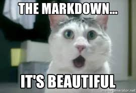

```{r setup, include=FALSE}
options(htmltools.dir.version = FALSE)
library(tidyverse)
library(icon)
```

```{r use-logo, echo=FALSE}
xaringanExtra::use_logo("https://tinyurl.com/yc9aqyna")
```

#This presentation is based on:

https://rmarkdown.rstudio.com/lesson-1.html

https://bookdown.org/yihui/rmarkdown/

https://github.com/adam-p/markdown-here/wiki/Markdown-Cheatsheet

https://ourcodingclub.github.io/2016/11/24/rmarkdown-1.html

---
## __What is markdown?__

A lightweight text editor originally built to be presented as html

<p>

---
## __What is Rmarkdowm?__

A __one-stop-shop__ for writing code and sharing your work with various formats

.center[
<p>
]
---

# __Type of outputs for Rmarkdown__ 

- Research notebook ([R Notebook](https://bookdown.org/yihui/rmarkdown/notebook.html))
- Reports ([html](https://bookdown.org/yihui/rmarkdown/html-document.html), [pdf](https://bookdown.org/yihui/rmarkdown/pdf-document.html), or [word](https://bookdown.org/yihui/rmarkdown/word-document.html))
- Websites ([Rmarkdown wbsite](https://bookdown.org/yihui/rmarkdown/rmarkdown-site.html)\ [blogdown](https://bookdown.org/yihui/rmarkdown/blogdown-start.html))
- Books ([bookdown](https://bookdown.org/yihui/rmarkdown/books.html))
- Presentations ([xringan](https://bookdown.org/yihui/rmarkdown/xaringan.html)\ [ioslides](https://bookdown.org/yihui/rmarkdown/ioslides-presentation.html))

---
# __The different parts of Rmarkdown__
<p>

---
## YAML header 

- Must be enclosed in `---`
- output section changes based on the type of ducument

```r
---
title: "Edinburgh Biodiversity"
author: John Doe
date: 22/Oct/2016
output: html_document
---

```

---
## Code chunk

- The chunk must be enclosed between ` ``` ` and then `{r}` at the top
- keybord shortcut: ctrl + Alt + I (Windows) or cmd + Alt + I (MacOS)

<p>

---
## __Plain text__

Here you write everything that isn't a code by using markdown related symbols to create headers, bold text , etc.

---
## __Workflow of Rmd file__

<p>

You create an Rmd file, then you knit it with knitr package, it is passed to one of the rendering packages like pandoc (for html) or LaTex (for pdf), and the final format is created

---
class: exercise

# __Practice time__

1. Open an Rmd file in the project you created before
2. Choose the type of document you want to create
3. Write some plain text and some analyses in the code chunk
4. Click on the knit botton at the top bar (or ctrl/cmd + shift + K)

---
__Congradulations!!!__ 🎉 🎊 🥳 You created your first Rmd file!! `r emo::ji("smile")`

.center[
<p>
]

---
class: inverse, center, middle

# __Rmd plain text syntax__

<p>

---

# __Headers__

```{r}
# Header 1
## Header 2
### Header 3
#### Header 4
##### Header 5
###### Header 6
```


---
# Header 1
## Header 2
### Header 3
#### Header 4
##### Header 5
###### Header 6

---
## Alternatively, for H1 and H2, an underline-ish style:

```

Alt-H1
======

Alt-H2
------

```

Alt-H1
======

Alt-H2
------

---

# Highlight text


__Bold text__ ` __Bold__` or ` **Bold** `

_Italics_ ` _Italics_ ` or ` *Italics* `

~~strikethrough~~ `~~strikethrough~~`

---

### Use these two links to learn how to adapt the text and the code to your needs:

https://www.rstudio.com/wp-content/uploads/2015/02/rmarkdown-cheatsheet.pdf

https://ourcodingclub.github.io/2016/11/24/rmarkdown-1.html

---

class: inverse, center, middle

# __Other formats of Rmarkdown__

<p>

---

## The YAML header for website
Here is an example from the website
```r
---
title: "Visualizations in R"
author: "Alex Slavenko and Maria Novosolov"
output:  
  html_document:  
    toc: true  
    toc_float: true
    collapsed: true
    smooth_scroll: true
    toc_depth: 3
    runtime: shiny_prerendered
    # number_sections: true
---


```

---
class: inverse, center, middle

## Lets check how it looks online

https://ecodatasci-tlv.github.io/visualizations_in_r/
---
# __Books__

### - Writen similar to a webslite but has a different YAML header

### - Uses `bookdown` package to generate


---
class: center, middle

More information on __websites__ and guidlines on how to build them can be found [here](https://bookdown.org/yihui/rmarkdown/websites.html)

More information about how to build __books__ can be found [here](https://bookdown.org/yihui/rmarkdown/books.html)
---
